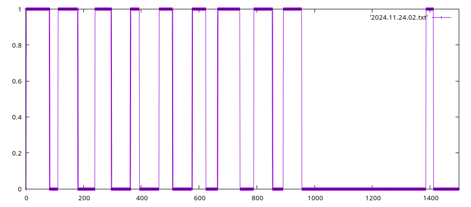

# RxIR

Simple digital waveform recorder that I coded up for analysis of IR traces. 

I hook up a IR receiver module to pin 33 (`ADC_5`). My module is active low, so 
the code waits for the signal to change from 1 to 0 and then records N samples 
at F kHz, printing them out as a sequence of 1s and 0s over the serial link at 
the end.  It then goes back to the waiting state, ready to trigger again.

My main purpose for this was to compare a reference IR trace and one I was 
generating for a project.

